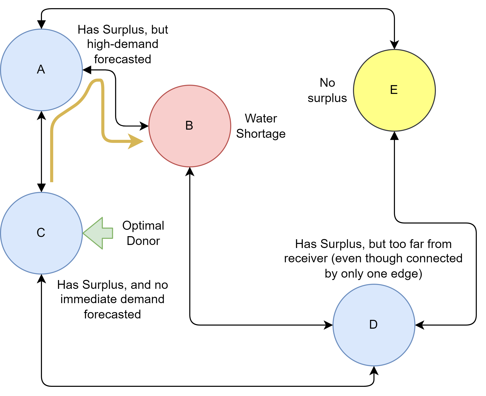
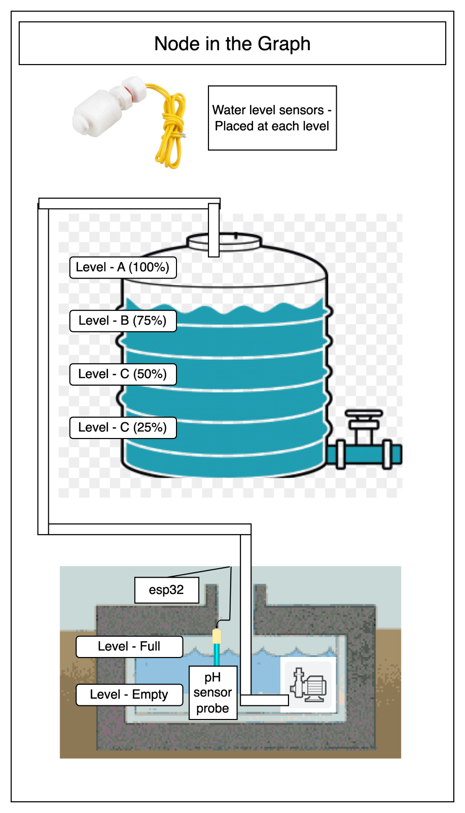
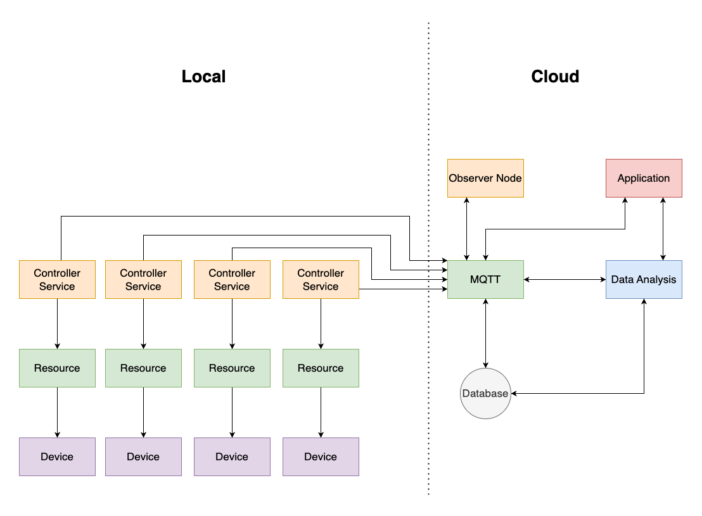
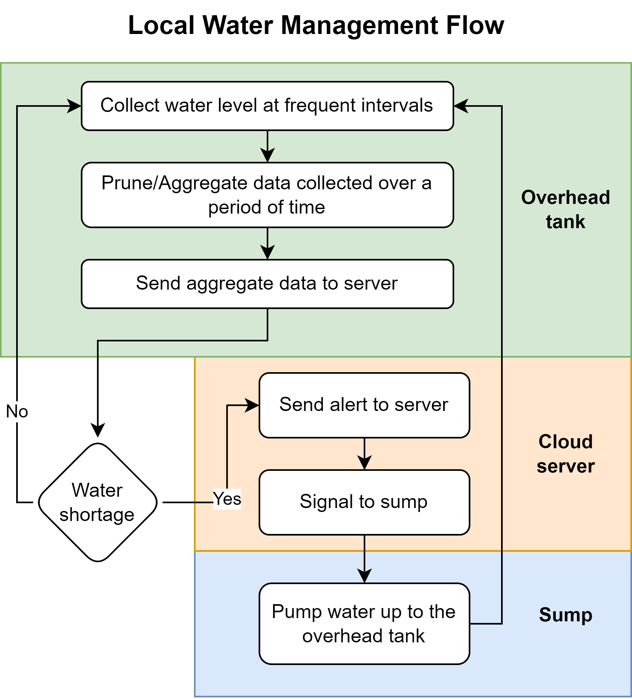
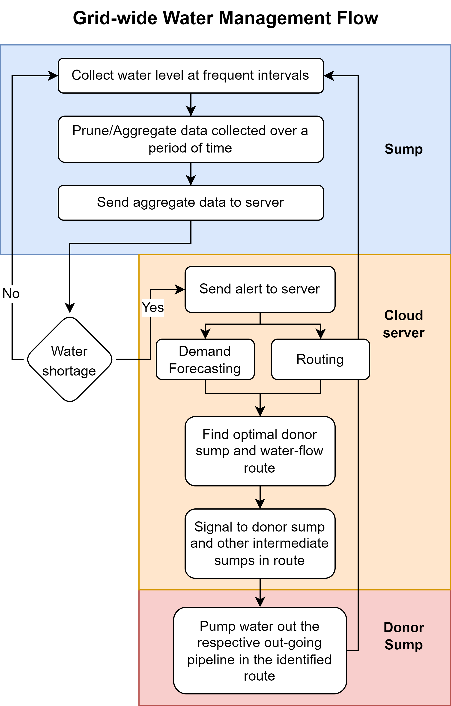

# RejuvenAqua - Intelligent Water Management System

## Model Overview:
The model aims to integrate and improve the existing water supply system. By building a network of water sumps in a region, water can be distributed optimally. This system reduces the need for manual intervention and aims to be more efficient than the existing methods of water management.

The primary function of our system is to transfer water from a node with excess supply to a node with water shortage. The system also takes into account the possible future demand while choosing a donor. The simple functioning can be understood through the following image:

This project requires focus on three fronts:
### 1. Node-level controller and data collection:
Each node consists of an underground sump and an overhead tank (OHT). There exists a "local" control system that detects dropping water levels in the OHT and transfers water from the sump to the OHT. This systems doesn't communicate with the global system at all and so it is self-sustaining as long as there is sufficient level of water in the sump.

Each node looks like this:

The global system is the network of sumps that manage water distribution among them. This requires each sump communicating with a central server to coordinate.

The high level system looks like this:

Each node (sump + OHT) is governed by an ESP32 microcontroller and water level switch sensors which collects data and sends it to the central server periodically. The ESP32 also controls the motors and valves in response to the commands from the server.

### 2. Demand forecasting:
The system predicts the future demand of water at each node from the usage data collected over a period of time. The trends identified from this data can be used to identify the optimal donor.

**E.g:** On a weekend, the water usage in schools will be close to zero and so, the excess of water in the school sump can be directed to a hospital sump where it might be of better use.

### 3. Optimal donor and route finding:

*An optimal donor is the one with excess of water and no immediate demand for it, and within a reasonable distance from the exhausted node.*

To identify an optimal donor, a heuristic-based path finding algorithm is used which attempts to minimise two factors in the donor node: distance from exhausted node, predicted near-future water demand. 

We use a modification of Dijkstra's algorithm for this purpose.

The simplified version of the code can be found in `routing_algo.py`.

The server sends the appropriate commands to each node along the path to make the ESP32s open the appropriate motors and valves.

## System Flow:

### Local flow:

### Global flow:

## Prototype:
We implemented this system as a prototype with 4 nodes. 

We used the following technologies and hardware

1. **Hardware:** 
    - ESP32
    - Water level switch sensor
    - Relay module
    - Servo motors
    - Valves
2. **Communication:** Wi-Fi (with MQTT protocol)
3. **Cloud Services:** 
    - AWS Iot Core (for MQTT)
    - Amazon DynamoDb
    - AWS Lambda (for handling alerts)

The code for the demo visualization website can be found [here](https://github.com/mava123-0/rejuven-aqua-website)